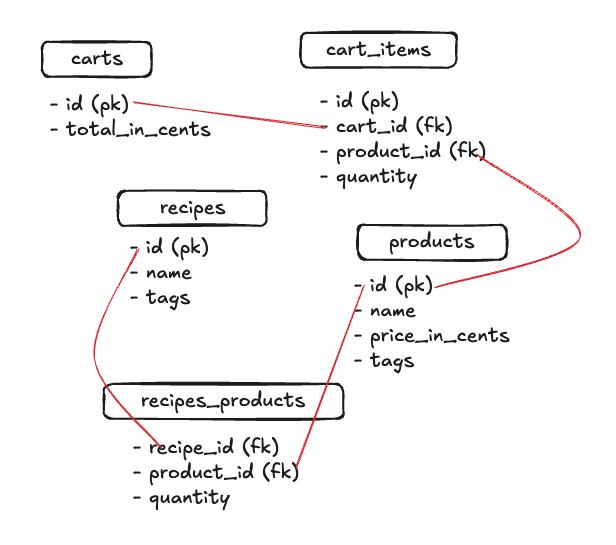

# Read me first: buy-recipe
The goal of this project is to manage superheroes and their attributes:
create and fetch superheroes and create new attributes (e.g new powers...).

* Designed simply yet flexible and extendable
* Clean
* Well-documented and well-tested

## Tech stack:
* Kotlin
* Spring 3
* RESTful endpoints 
* Docker to build image & run the project from anywhere
* Docker-compose to start the DB
* Postgres as a relational DB
* Liquibase DB migration tool to set up tables

### Assumptions:
* All the products are always available
* Anyone can manipulate any cart - no user management expected

### Functional requirements:
* get shopping cart content
* get existing recipes
* add a recipe to cart content
* delete a recipe from a cart

### What is implemented:
An API layer that supports:
* list recipes with pagination
* view ingredients and costs
* add recipes to cart
* create new recipes



### Future improvements:

#### Business-wise
* Set up and manage application users, with authentication (e.g. access with JWT token) and authorization, to access their cart only
* Sophisticated mapping of products-ingredients, in terms of quantity (units os measure, optimize how much to buy)
* Sophisticated mapping of products-ingredients, in terms of priority (which products to buy for the same ingredient)
* Add nutritional info to the products and a better tagging/classification system

#### Technical
* Add OpenAPI spec to document the endpoints
* Implement error handling with consistent error objects (consider JSON API spec as reference)
* Count inventory - after every buy, remove amount of available product
* Introduce a robust pricing type, for example a Price type (BigDecimal, Currency)
* Add an API rate limit for security reasons


## How to run this project:
Create a local postgres DB
```
docker-compose up -d
```
I Used Tableplus to interact with the DB (view tables etc.), using the application.yml credentials.
Pgadmin or any other client should work as well.

Start the spring project
```
./gradlew bootRun
```

### Deploy:
Build Docker image
```
docker build -t imthedoggo/buy-recipe .
```
Run the image locally
```
docker run -p 8081:8080 -d imthedoggo/buy-recipe 
```

### Endpoints:

| Method  | Resource                        | Description                        |
|---------|----------------------------------|------------------------------------|
| GET     | /api/recipes                    | List recipes (with pagination)     |
| GET     | /api/recipes/{id}               | Get recipe details by ID           |
| POST    | /api/recipes                    | Create a new recipe                |
| GET     | /api/carts/{id}                 | Get cart by ID                     |
| POST    | /api/carts/{id}/add-recipe      | Add a recipe to cart               |
| DELETE  | /api/carts/delete-recipe        | Delete recipe from cart            |

### Examples

#### GET /api/recipes?page=0&pageSize=2
Response:
```
{
  "recipes": [
    {
      "id": 1,
      "name": "Vegan Salad",
      "tags": ["VEGAN"],
      "ingredientCount": 2,
      "estimatedCostInCents": 500
    },
    {
      "id": 2,
      "name": "Keto Omelette",
      "tags": ["KETO"],
      "ingredientCount": 3,
      "estimatedCostInCents": 800
    }
  ],
  "totalCount": 2,
  "page": 0,
  "pageSize": 2
}
```

#### GET /api/recipes/1
Response:
```
{
  "id": 1,
  "name": "Vegan Salad",
  "tags": ["VEGAN"],
  "ingredients": [
    {
      "productId": 1,
      "productName": "Lettuce",
      "quantity": 1,
      "priceInCents": 200,
      "totalPriceInCents": 200
    },
    {
      "productId": 2,
      "productName": "Tomato",
      "quantity": 2,
      "priceInCents": 150,
      "totalPriceInCents": 300
    }
  ],
  "totalCostInCents": 500
}
```

#### POST /api/recipes
Request:
```
{
  "name": "Vegan Salad",
  "tags": ["VEGAN"],
  "ingredients": [
    { "productId": 1, "quantity": 1 },
    { "productId": 2, "quantity": 2 }
  ]
}
```
Response (success):
```
{
  "success": true,
  "recipeId": 1,
  "recipe": {
    "id": 1,
    "name": "Vegan Salad",
    "tags": ["VEGAN"],
    "ingredients": [
      {
        "productId": 1,
        "productName": "Lettuce",
        "quantity": 1,
        "priceInCents": 200,
        "totalPriceInCents": 200
      },
      {
        "productId": 2,
        "productName": "Tomato",
        "quantity": 2,
        "priceInCents": 150,
        "totalPriceInCents": 300
      }
    ],
    "totalCostInCents": 500
  },
  "message": "Recipe created successfully",
  "errors": []
}
```
Response (validation error):
```
{
  "success": false,
  "recipeId": null,
  "recipe": null,
  "message": "Validation failed",
  "errors": ["Recipe name cannot be empty"]
}
```

#### GET /api/carts/1
Response:
```
{
  "id": 1,
  "totalInCents": 500,
  "items": [
    {
      "id": 1,
      "cartId": 1,
      "productId": 1,
      "quantity": 1,
      "product": {
        "id": 1,
        "name": "Lettuce",
        "priceInCents": 200,
        "tags": ["VEGAN"]
      }
    },
    {
      "id": 2,
      "cartId": 1,
      "productId": 2,
      "quantity": 2,
      "product": {
        "id": 2,
        "name": "Tomato",
        "priceInCents": 150,
        "tags": ["VEGAN"]
      }
    }
  ]
}
```

#### POST /api/carts/1/add-recipe
Request:
```
{
  "recipeId": 1,
  "cartId": 1
}
```
Response:
```
{
  "success": true,
  "addedItems": [
    {
      "productId": 1,
      "productName": "Lettuce",
      "quantityAdded": 1,
      "isNewItem": true
    },
    {
      "productId": 2,
      "productName": "Tomato",
      "quantityAdded": 2,
      "isNewItem": true
    }
  ],
  "updatedCartTotal": 500,
  "message": "Recipe added to cart"
}
```

#### DELETE /api/carts/delete-recipe
Request:
```
{
  "recipeId": 1,
  "cartId": 1
}
```
Response:
```
{
  "success": true,
  "removedItems": [
    {
      "productId": 1,
      "productName": "Lettuce",
      "quantityRemoved": 1,
      "remainingQuantity": 0,
      "itemCompletelyRemoved": true
    },
    {
      "productId": 2,
      "productName": "Tomato",
      "quantityRemoved": 2,
      "remainingQuantity": 0,
      "itemCompletelyRemoved": true
    }
  ],
  "updatedCartTotal": 0,
  "message": "Recipe removed from cart"
}
```
